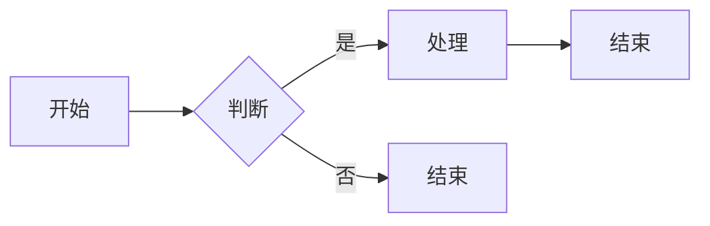
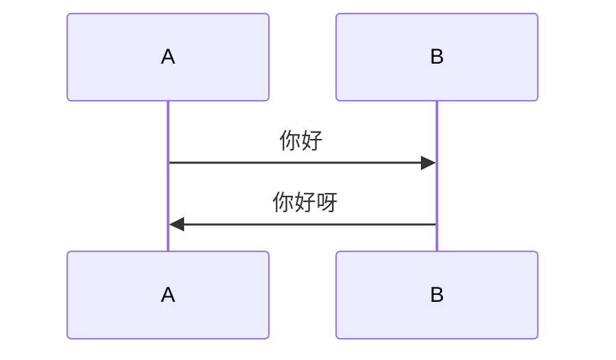
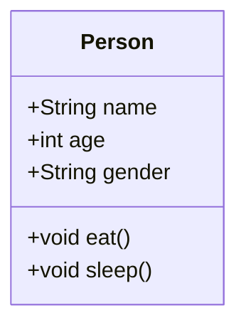
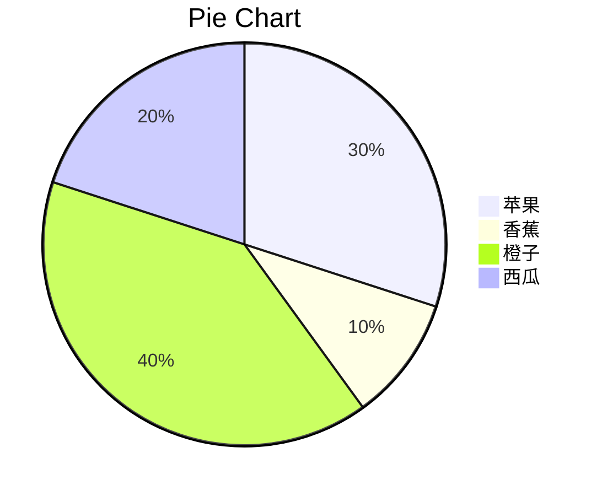

### 一、markdown入门
1.**标题**
# 一级标题
## 二级标题
### 三级标题
#### 四级标题
##### 五级标题
###### 六级标题  

2.**引用**
>这个很好用
>这个很好用


3.**列表**
- [ ] a
- [ ] c
- [ ] d

4.**链接**
[百度](https://www.baidu.com)
5.**图片**

6.**粗体**
**粗体**
7.**斜体**
*斜体*
8.**粗斜体**
***粗斜体***
9.**代码**
`代码`
10.**表格**
|姓名|年龄|性别|
|:--:|:--:|:--:|
|张三|18|男|
|李四|19|女|
11.**分割线**
---
12.**转义字符**
\*
\#
13.**数学公式**
$$
\sum_{i=1}^{n}i=\frac{n(n+1)}{2}
$$
- 脚注[^1]: 脚注内容
14.**流程图**

15.**时序图**

16.**甘特图**
```mermaid
gantt
title 甘特图
section 项目A
任务1:active, des1, 2022-01-01, 30d
任务2  des2, after des1, 20d
section 项目B
任务3 des3, 2022-01-12, 12d
任务4 des4, after des3, 24d
```
17.**类图**

18.**饼图**

19.**折线图**
```mermaid
gantt
title 折线图
section 项目A
任务1:active, des1, 2022-01-01, 30d
任务2  des2, after des1, 20d
section 项目B
任务3 des3, 2022-01-12, 12d
任务4 des4, after des3, 24d
```
20.**地图**
```mermaid
map
title 地图
section 项目A
任务1:active, des1, 2022-01-01, 30d
任务2  des2, after des1, 20d
section 项目B
任务3 des3, 2022-01-12, 12d
任务4 des4, after des3, 24d
```
21.**甘特图**
```mermaid
gantt
title 甘特图
section 项目A
任务1:active, des1, 2022-01-01, 30d
任务2  des2, after des1, 20d
section 项目B
任务3 des3, 2022-01-12, 12d
任务4 des4, after des3, 24d
```
22.**表格**
| 左对齐 | 右对齐 | 居中对齐 |
| :----- | :-----: | :-----: |
| a | b  | c  |

23.**段落**

 - 换行？——两个以上空格后回车/空一行
  abc
 - 分割线———三个以上减号、星号、下划线
 - 字体
  
  | 字体 | 代码 |
  | :---: | :---: |
  |*斜体*|* *|
  |==高亮==|== ==|
  |**粗体**|** **|
  |***粗斜体***|*** ***|
  |~~删除线~~|~~ ~~|
  |`代码`|` `` `|
  |<u>下划线</u>|`<u> </u>`|
  |下标|~下标~|
  |上标|^上标^|
  |引用|>引用|
  |脚注|[^1]|
  24.**代码**
```
#include <iostream>
#include <iomanip>
using namespace std;
typedef struct st {
    int a[20];
}ST;
```
`printf("hello world");`
25.**链接**
[百度](https://www.baidu.com)
- 查看更多功能请[点击链接][教程]
26.**图片**
- 使用图床保存图片进行插入
   [路过图床]：https://imgchr.com/

- 使用markdown插入
[](https://imgse.com/i/pADzyM4)

 
 :) :()
[教程]: https://www.runoob.com/markdown/md-tutorial.html
[^1]    : 这是一个注释
